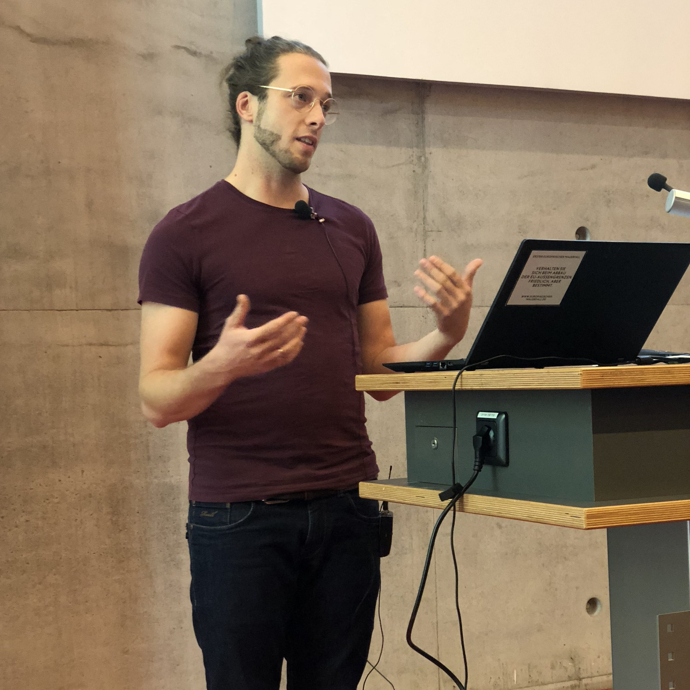

Kurzankündigung

***

<!--Deiglmay-->

<h3>Prof. Dr. Anne Deiglmayr</h3>

<b>Inhaberin der Professur</b> 
Prof. Dr. Anne Deiglmayr ist seit 12/2018 Inhaberin der Professur „Empirische Schul- und Unterrichtsforschung“ an der Erziehungswissenschaftlichen Fakultät der Universität Leipzig. Ihre Forschungsschwerpunkte umfassen u.a. Methoden der mobilen Unterrichtsforschung, die Professionsentwicklung von Lehrpersonen, Lehr- und Lernprozesse beim (computergestützten) kooperativen Lernen, sowie die Förderung des Lehrens und Lernens im MINT-Unterricht. Prof. Deiglmayr bietet Lehrveranstaltungen im Bereich der bildungswissenschaftlichen Module der Lehramtsstudiengänge (insbesondere Modul 02 „Praxis- und Studienfeld Schule“) sowie im Bereich der Ergänzungsstudien an (insbesondere zu Methoden der empirischen Sozialforschung). 

<table class="tab24" align="left" border="0" cellpadding="0" cellspacing="0" width="100%">
<tr bgcolor="#BDBDBD">
<td width="0%" height="" style="padding-left:15px; padding-right:15px;"></td>
<td width="0%" align="left"><b>Kontakt und Kurzbiografie</b></td>
<td align="right" width="33%" style="padding-left:15px; padding-right:15px;">
<a href="#swap" onclick="javascript:swap('Einblenden','Ausblenden', 'swaplink', 'hideme')" id="swaplink" onfocus="this.blur()" name="swaplink">Einblenden</a>
</td>
</tr> 
<tr style=" text-align: justify; font-size: 16px; font-weight: normal; background-color: 245,245,245;">
<td colspan="3" style="padding-left:15px; padding-right:15px;">

  

<b>Kontakt</b>

  
Telefon: +49 (0) 341 97-31571 
  E-Mail: <a href="mailto:anne.deiglmayr@uni-leipzig.de">anne.deiglmayr@uni-leipzig.de</a> 
  Raum: 008 
  Sprechzeit: Mittwoch 11:00-12:00

<b>Kurzbiografie</b> 
      

        <table>
          <tbody>
            <tr>
              <td>seit 2018</td>
              <td>seit 2018 Professorin für Empirische Schul- und Unterrichtsforschung an der Erziehungswissenschaftlichen Fakultät der Universität Leipzig</td>
            </tr>
            <tr>
              <td>2013-2018</td>
              <td>Oberassistentin am Lehrstuhl für Lehr- und Lernforschung, ETH Zürich</td>
            </tr>
            <tr>
              <td>2012-2013</td>
              <td>2012-2013  Postdoc am Lehrstuhl für Lehr- und Lernforschung, ETH Zürich: Marie-Heim-Vögtlin-Stipendium des Schweizer Nationalfonds</td>
            </tr>
            <tr>
              <td>2011-2012</td>
              <td>Dozentin mit Forschungsauftrag am Institut für Medien und Schule der Pädagogischen Hochschule Zentralschweiz</td>
            </tr>
            <tr>
              <td>2008-2010</td>
              <td>Wissenschaftliche Mitarbeiterin in der Abteilung Allgemeine Psychologie der Albert-Ludwigs-Universität Freiburg</td>
            </tr>
            <tr>
              <td>2009</td>
              <td>Promotion (Dr. phil.), Albert-Ludwigs-Universität Freiburg; ausgezeichnet mit dem Eugen-Fink-Nachwuchsförderpreis (2011)</td>
            </tr>
            <tr>
              <td>2005-2008</td>
              <td>Stipendiatin im Virtuellen Graduiertenkolleg „Wissenserwerb und Wissensaustausch mit neuen Medien” (DFG)</td>
            </tr>
            <tr>
              <td>2005</td>
              <td>Diplom (Dipl.-Psych.), Albert-Ludwigs-Universität Freiburg</td>
            </tr>
            <tr>
              <td>2002-2003</td>
              <td>Studium am Department of Psychology der University of Michigan, Ann Arbor</td>
            </tr>
            <tr>
              <td>1999-2005</td>
              <td>Studium der Psychologie, Albert-Ludwigs-Universität Freiburg</td>
            </tr>
          </tbody>
        </table>
      

    

 

</td>
</tr>
</table> 

<!--Kachel-->

<h3>Dr. Gregor Kachel</h3>

<b>Wissenschaftlicher Mitarbeiter/PI</b> 
Gregor Kachel leitet das DFG-Projekt SymLit und forscht darin zur Entwicklung des graphischen Symbolverständnisses im Vorschulalter. Er ist wissenschaftlicher Mitarbeiter an der Professur für Empirische Schul- und Unterrichtsforschung und Gastwissenschaftler in der Abteilung für Vergleichende Kulturpsychologie am MPI EVA. 

<table class="tab24" align="left" border="0" cellpadding="0" cellspacing="0" width="100%">
<tr bgcolor="#BDBDBD">
<td width="0%" height="35" style="padding-left:15px; padding-right:15px;"></td>
<td width="0%" align="left"><b>Kontakt und Kurzbiografie</b></td>
<td align="right" width="33%" style="padding-left:15px; padding-right:15px;">
<a href="#swap" onclick="javascript:swap('Einblenden','Ausblenden', 'swaplink1', 'hideme1')" id="swaplink1" onfocus="this.blur()" name="swaplink1">Einblenden</a>
</td>
</tr> 
<tr style=" text-align: justify; font-size: 16px; font-weight: normal; background-color: 245,245,245;">
<td colspan="3" style="padding-left:15px; padding-right:15px;">

  

<b>Kontakt</b>

 
Telefon:    +49 (0) 341 97-31572 
E-Mail:     <a href="mailto:mandy.klatt@uni-leipz.de">mandy.klatt@uni-leipzig.de</a> 
Raum:       010 
Sprechzeit: Mittwoch 11:00-12:00 Uhr 

</td>
</tr>
</table> 

