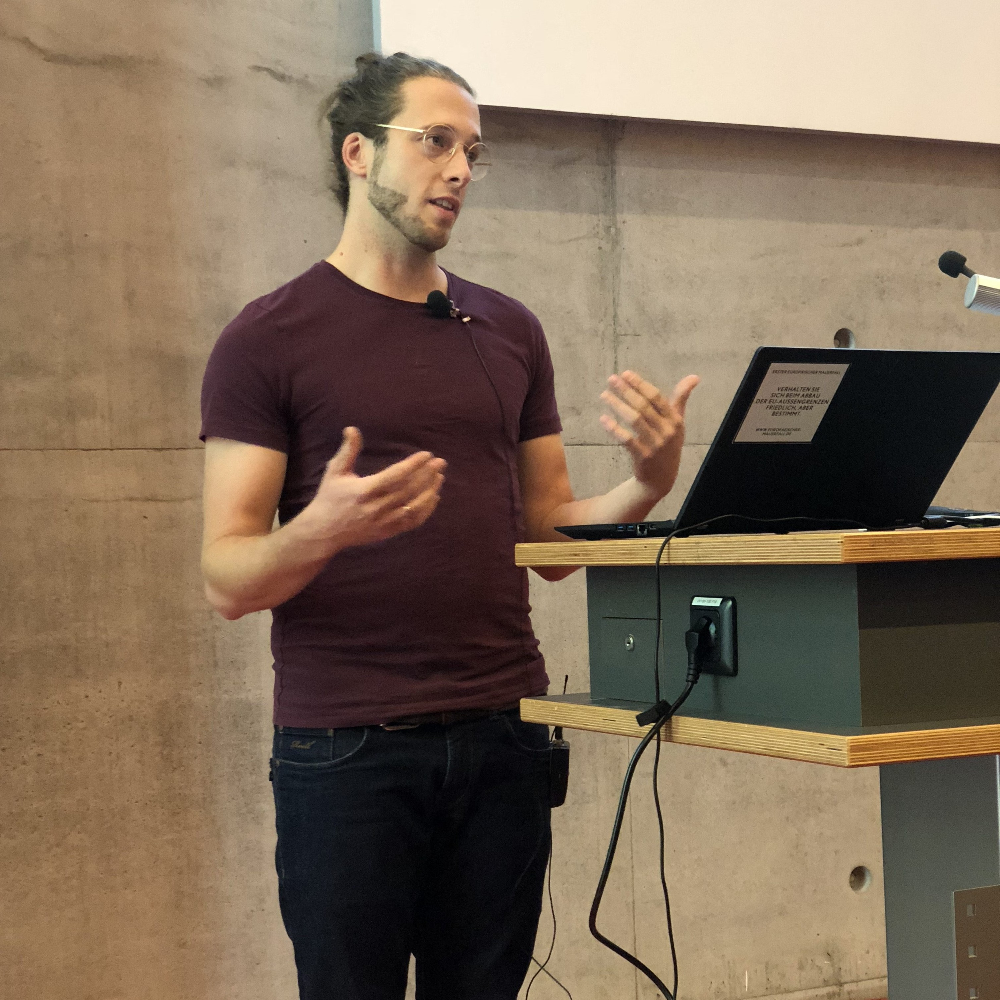

Kurzankündigung

***
<!--Deiglmayr-->
<h3>Prof. Dr. Anne Deiglmayr</h3>

<b>Inhaberin der Professur</b>

Prof. Dr. Anne Deiglmayr ist seit 12/2018 Inhaberin der Professur „Empirische Schul- und Unterrichtsforschung“ an der Erziehungswissenschaftlichen Fakultät der Universität Leipzig. Ihre Forschungsschwerpunkte umfassen u.a. Methoden der mobilen Unterrichtsforschung, die Professionsentwicklung von Lehrpersonen, Lehr- und Lernprozesse beim (computergestützten) kooperativen Lernen, sowie die Förderung des Lehrens und Lernens im MINT-Unterricht. Prof. Deiglmayr bietet Lehrveranstaltungen im Bereich der bildungswissenschaftlichen Module der Lehramtsstudiengänge (insbesondere Modul 02 „Praxis- und Studienfeld Schule“) sowie im Bereich der Ergänzungsstudien an (insbesondere zu Methoden der empirischen Sozialforschung). 

<table class="tab24" align="left" border="0" cellspacing="0" cellpadding="0" width="100%">
<tr bgcolor="#BDBDBD">
<td width="0%" height="30" style="padding-right: 15px; padding-left: 15px;"><b>Kontakt und Kurzbiografie</b></td>
<td align="right" width="33%" style="padding-left:15px; padding-right:15px;">
<a href="#swap" onclick="javascript:swap('Einblenden','Ausblenden', 'swaplink', 'hideme')" id="swaplink" onfocus="this.blur()" name="swaplink">Einblenden</a>
</td>
</tr>
<tr style="text-align: justify; font-size: 16px; font-weight: normal; background-color: 245,245,245;">
<td colspan="3" style="padding-right: 15px; padding-left: 15px;">

 

  
<strong>Telefon:</strong> +49 (0) 341 97-31571  <strong>E-Mail:</strong> <a href="mailto:anne.deiglmayr@uni-leipzig.de">anne.deiglmayr@uni-leipzig.de</a>  <strong>Raum:</strong> 008  <strong>Sprechzeit:</strong> Mittwoch 11:00-12:00 Uhr

  
<b>Kurzbiografie</b> 
      

        <table>
          <tbody>
            <tr>
              <td>seit 2018</td>
              <td>Professorin für Empirische Schul- und Unterrichtsforschung an der Erziehungswissenschaftlichen Fakultät der Universität Leipzig</td>
            </tr>
            <tr>
              <td>2013 - 2018</td>
              <td>Oberassistentin am Lehrstuhl für Lehr- und Lernforschung, ETH Zürich</td>
            </tr>
            <tr>
              <td>2012 - 2013</td>
              <td>Postdoc am Lehrstuhl für Lehr- und Lernforschung, ETH Zürich: Marie-Heim-Vögtlin-Stipendium des Schweizer Nationalfonds</td>
            </tr>
            <tr>
              <td>2011 - 2012</td>
              <td>Dozentin mit Forschungsauftrag am Institut für Medien und Schule der Pädagogischen Hochschule Zentralschweiz</td>
            </tr>
            <tr>
              <td>2008 - 2010</td>
              <td>Wissenschaftliche Mitarbeiterin in der Abteilung Allgemeine Psychologie der Albert-Ludwigs-Universität Freiburg</td>
            </tr>
            <tr>
              <td>2009</td>
              <td>Promotion (Dr. phil.), Albert-Ludwigs-Universität Freiburg; ausgezeichnet mit dem Eugen-Fink-Nachwuchsförderpreis (2011)</td>
            </tr>
            <tr>
              <td>2005 - 2008</td>
              <td>Stipendiatin im Virtuellen Graduiertenkolleg „Wissenserwerb und Wissensaustausch mit neuen Medien” (DFG)</td>
            </tr>
            <tr>
              <td>2005</td>
              <td>Diplom (Dipl.-Psych.), Albert-Ludwigs-Universität Freiburg</td>
            </tr>
            <tr>
              <td>2002 - 2003</td>
              <td>Studium am Department of Psychology der University of Michigan, Ann Arbor</td>
            </tr>
            <tr>
              <td>1999 - 2005</td>
              <td>Studium der Psychologie, Albert-Ludwigs-Universität Freiburg</td>
            </tr>
          </tbody>
        </table>
      

</td>
</tr>
</table>

<!--Pagel-->

<h3>Anne-Kathrin Pagel</h3>

<b>Sekretariat</b> 

Anne-Katrhin Pagel ist Sekräterin an der Professur „Empirische Schul- und Unterrichtsforschung“ an der Erziehungswissenschaftlichen Fakultät der Universität Leipzig. 

</script>
<table class="tab24" align="left" border="0" cellspacing="0" cellpadding="0" width="100%">
<tr bgcolor="#BDBDBD">
<td width="0%" height="30" style="padding-right: 15px; padding-left: 15px;"><b>Kontakt und Kurzbiografie</b></td>
<td align="right" width="33%" style="padding-left:15px; padding-right:15px;">
<a href="#swap" onclick="javascript:swap('Einblenden','Ausblenden', 'swaplink1', 'hideme1')" id="swaplink1" onfocus="this.blur()" name="swaplink1">Einblenden</a>
</td>
</tr>
<tr style="text-align: justify; font-size: 16px; font-weight: normal; background-color: 245,245,245;">
<td colspan="3" style="padding-right: 15px; padding-left: 15px;">

 

  
<b>Telefon:</b> +49 (0) 341 97-31570 
  <b>E-Mail:</b> <a href="mailto:empschul@uni-leipzig.de">empschul@uni-leipzig.de</a> 
  <b>Raum:</b> 009 
  <b>Sprechzeit:</b> Mittwoch 09:00-12:00 Uhr

  
<b>Kurzbiografie</b>

  

        <table>
          <tbody>
            <tr>
              <td>seit 2019</td>
              <td>Sekretärin an der Professur für Empirische Schul- und Unterrichtsforschung</td>
            </tr>
            <tr>
              <td>2006 - 2019</td>
              <td>verschiedene Beschäftigungen an der TU Dresden und Universität Leipzig</td>
            </tr>
            <tr>
              <td>2003 - 2006</td>
              <td>Ausbildung zur Fremdsprachensekretärin</td>
            </tr>
          </tbody>
        </table>
      

    

</td>
</tr>
</table>

<!--Kachel-->

<h3>Dr. Gregor Kachel</h3>

<b>Wissenschaftlicher Mitarbeiter/PI</b> 

Gregor Kachel leitet das DFG-Projekt SymLit und forscht darin zur Entwicklung des graphischen Symbolverständnisses im Vorschulalter. Er ist wissenschaftlicher Mitarbeiter an der Professur für Empirische Schul- und Unterrichtsforschung und Gastwissenschaftler in der Abteilung für Vergleichende Kulturpsychologie am MPI EVA. 

</script>

<table width="100%" align="left" class="tab24" border="0" cellspacing="0" cellpadding="0">
<tbody>
<tr bgcolor="#bdbdbd">
<td width="0%" height="30" style="width: 100%; padding-right: 15px; padding-left: 15px;"><strong>Kontakt und Kurzbiografie</strong></td>
<td width="33%" align="right" style="width: 33%; padding-right: 15px; padding-left: 15px;"><a name="swaplink2" id="swaplink2" onclick="javascript:swap('Einblenden','Ausblenden', 'swaplink2', 'hideme2')" onfocus="this.blur()" href="#swap">Einblenden</a></td>
</tr>
<tr style="text-align: justify; font-size: 16px; font-weight: normal; background-color: 245,245,245;">
<td style="width: 52.1%; padding-right: 15px; padding-left: 15px;" colspan="3">

 

  
<b>Telefon:</b> +49 (0) 341 97-31573 
  <b>E-Mail:</b> <a href="mailto:gregor.kachel@uni-leipzig.de">gregor.kachel@uni-leipzig.de</a> 
  <b>Raum:</b> 005 
  <b>Webseite:</b> <a href="https://gregorkachel.github.io">https://gregorkachel.github.io</a>

  
<b>Kurzbiografie</b>

  In Bearbeitung

</td>
</tr>
</table>

<!--Klatt-->

<h3>Mandy Klatt</h3>

<b>Wissenschaftliche Mitarbeiterin</b> 

Mandy Klatt forscht und lehrt als wissenschaftliche Mitarbeiterin an der Professur „Empirische Schul- und Unterrichtsforschung“ an der Erziehungswissenschaftlichen Fakultät der Universität Leipzig. 
Im Mittelpunkt ihrer Forschungsinteressen stehen neue, multimodale Methoden zur Erforschung von Lehr- und Lernprozessen wie mehrkanalige Prozessmessungen, Eye-Tracking, Audio- und Videografie im Unterricht. Ziel ist es außerdem, automatisierte Analyseverfahren anhand von Beobachtungsdaten zu validieren, um sie für die Unterrichtsforschung nutzbar zu machen. In ihrer Dissertation widmet sie sich u.a. der Fragestellung nach der Expertiseentwicklung von Lehrpersonen.
Mandy Klatt bietet Lehrveranstaltungen im Bereich der bildungswissenschaftlichen Module der Lehramtsstudiengänge (Modul 02 „Praxis- und Studienfeld Schule“) an. 
Vor ihrer Beschäftigung an der Universität Leipzig absolvierte sie einen anderthalbjährigen Aufenthalt in Frankreich mit Lehrtätigkeit.
 

</script>

<table width="100%" align="left" class="tab24" border="0" cellspacing="0" cellpadding="0">
<tbody>
<tr bgcolor="#bdbdbd">
<td width="0%" height="30" style="width: 100%; padding-right: 15px; padding-left: 15px;"><strong>Kontakt und Kurzbiografie</strong></td>
<td width="33%" align="right" style="width: 33%; padding-right: 15px; padding-left: 15px;"><a name="swaplink3" id="swaplink3" onclick="javascript:swap('Einblenden','Ausblenden', 'swaplink3', 'hideme3')" onfocus="this.blur()" href="#swap">Einblenden</a></td>
</tr>
<tr style="text-align: justify; font-size: 16px; font-weight: normal; background-color: 245,245,245;">
<td style="width: 52.1%; padding-right: 15px; padding-left: 15px;" colspan="3">

 

  
</b>Telefon:</b> +49 (0) 341 97-31572 
  <b>E-Mail:</b> <a href="mailto:mandy.klatt@uni-leipz.de">mandy.klatt@uni-leipzig.de</a> 
  <b>Raum:</b> 010 
  <b>Sprechzeit:</b> Mittwoch 11:00-12:00 Uhr

  
  
<b>Kurzbiografie</b>

 

        <table>
          <tbody>
            <tr>
              <td>seit 10/2019</td>
              <td>Wissenschaftliche Mitarbeiterin an der Universität Leipzig, Erziehungswissenschaftliche Fakultät, Professur für Empirische Schul- und Unterrichtsforschung</td>
            </tr>
            <tr>
              <td>05/2019 - 09/2019</td>
              <td>Übersetzungs- und Dolmetschertätigkeit in Frankreich</td>
            </tr>
            <tr>
              <td>04/2018 - 04/2019</td>
              <td>Lehrtätigkeit für Deutsch als Fremdsprache in Frankreich, Sekundarstufe I + II</td>
            </tr>
            <tr>
              <td>05/2017 - 10/2017</td>
              <td>Lehrtätigkeit für Deutsch als Zweitsprache, Flüchtlingsrat Leipzig e.V.</td>
            </tr>
            <tr>
              <td>10/2011 - 03/2018</td>
              <td>Studium Deutsch und Französisch für Höheres Lehramt an Gymnasien an der Universität Leipzig/ 1. Staatsexamen</td>
            </tr>
          </tbody>
        </table>
      

</td>
</tr>
</table>

<!--Frohberg-->

<h3>Franziska Frohberg</h3>

<b>Lehrkraft für besondere Aufgaben</b> 

Franziska Frohberg lehrt und forscht am Institut für Bildungswissenschaften am Lehrstuhl für Empirische Schul- und Unterrichtsforschung an der Universität Leipzig. Sie lehrt in den Modulen 1 und 2 der Bildungswissenschaften. Im Mittelpunkt ihrer Forschungsinteressen stehen Implizite Theorie zu Intelligenz, Veränderung von Mindsets bei Lehrpersonen und deren Einfluss auf Lehr-Lern-Arrangements. 
 

</script>

<table width="100%" align="left" class="tab24" border="0" cellspacing="0" cellpadding="0">
<tbody>
<tr bgcolor="#bdbdbd">
<td width="0%" height="30" style="width: 100%; padding-right: 15px; padding-left: 15px;"><strong>Kontakt und Kurzbiografie</strong></td>
<td width="33%" align="right" style="width: 33%; padding-right: 15px; padding-left: 15px;"><a name="swaplink4" id="swaplink4" onclick="javascript:swap('Einblenden','Ausblenden', 'swaplink4', 'hideme4')" onfocus="this.blur()" href="#swap">Einblenden</a></td>
</tr>
<tr style="text-align: justify; font-size: 16px; font-weight: normal; background-color: 245,245,245;">
<td style="width: 52.1%; padding-right: 15px; padding-left: 15px;" colspan="3">

 

  
</b>Telefon:</b> ++49 (0) 341 97-31572 
  <b>E-Mail:</b> <a href="mailto:franziska.frohberg@uni-leipzig.de">franziska.frohberg@uni-leipzig.de</a> 
  <b>Raum:</b> 010 
  <b>Sprechzeit:</b> Dienstag 09:00-10:00 Uhr (Anmeldung per E-Mail)

  
  
<b>Kurzbiografie</b>

 

        <table>
          <tbody>
            <tr>
              <td>seit 08/2019</td>
              <td>Lehrkraft für besondere Aufgaben im Arbeitsbereich Allgemeine Didaktik</td>
            </tr>
            <tr>
              <td>seit 02/2019</td>
              <td>Lehrkraft für besondere Aufgaben im Arbeitsbereich Empirische Schul- und Unterrichtsforschung</td>
            </tr>
            <tr>
              <td>2015 - 2018</td>
              <td>Master Begabungsforschung und Kompetenzentwicklung, Universität Leipzig</td>
            </tr>
            <tr>
              <td>2014 - 2015</td>
              <td>Integrationspädagogin an der Montessorischule Huckepack Dresden e.V. </td>
            </tr>
            <tr>
              <td>2011 - 2015 </td>
              <td>Bachelor Pädagogik mit Nebenfach Psychologie, Technische Universität Chemnitz</td>
            </tr>
          </tbody>
        </table>
      

</td>
</tr>
</table>
