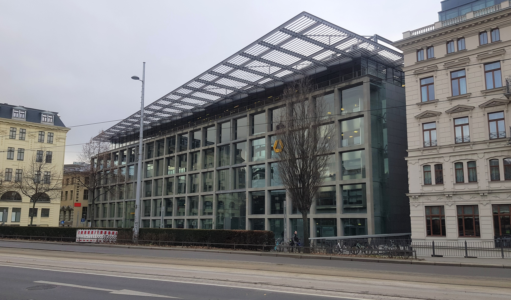

### Kontakt

#### Inhaberin der Professur

**Prof. Dr. Anne Deiglmayr**  
04109 Leipzig  
Dittrichring 5-7 
Raum 008 
Tel.: +49 (0) 341 97-31571  
E-Mail: [anne.deiglmayr@uni-leipzig.de](anne.deiglmayr@uni-leipzig.de)  
Sprechzeit: Mittwoch 11:00 – 12:00 Uhr

#### Sekretariat

**Anne-Kathrin Pagel**  
04109 Leipzig  
Dittrichring 5-7  
Raum 009  
Tel.: +49 (0) 341 97-31570  
E-Mail: [empschul@uni-leipzig.de](empschul@uni-leipzig.de)  
Sprechzeit: Mittwoch 09:00 – 12:00 Uhr

***

### Adresse

<table>
  <thead>
    <tr>
      <th>Universität Leipzig 
          Erziehungswissenschaftliche Fakultät   
          Institut für Bildungswissenschaften   
          Professur für Empirische Schul- und Unterrichtsforschung   
          Dittrichring 5-7  
          04109 Leipzig</th>
      <th><iframe src="https://www.google.com/maps/embed?pb=!1m18!1m12!1m3!1d2372.2327579763164!2d12.373387629344208!3d51.33891480782422!2m3!1f0!2f0!3f0!3m2!1i1024!2i768!4f13.1!3m3!1m2!1s0x47a6f826e1d7ff6d%3A0xc2ce10d57bdf591!2sDittrichring%205%2C%2004109%20Leipzig!5e0!3m2!1sde!2sde!4v1591795377312!5m2!1sde!2sde" width="400" height="300" frameborder="0" style="border:0;" allowfullscreen="" aria-hidden="false" tabindex="0"></iframe></th>
    </tr>
  </thead>
  <tbody>

### Anreise

Die Büros und das Labor der Professur für "Empirische Schul- Unterrichtsforschung" befinden sich am Dittrichring und schräg gegenüber der Thomaskirche im westlichen Zentrum Leipzigs. Das Gebäude erreichen Sie über eine der beiden größeren Brücken über dem Pleißemühlgraben. Auf der linken Seite des Gebäudes befindet sich die Commerzbank, auf der rechten Seite die Erziehungswissenschaftliche Fakultät der Universität Leipzig. Nutzen Sie den Haupteingang und gehen sie anschließend nach rechts. Öffnen Sie die Glastür zum Computerbereich und die folgende Holztür zu den Büros und Seminarräumen der Fakultät. Die Räumlichkeiten unseres Teams befinden sich entlang des Ganges im Erdgeschoss.  

    

		

		

		

		

Sie erreichen uns schnell und einfach mit dem Auto, dem ÖPNV, dem Fahrrad oder auch zu Fuß.

**Auto:** 
Parkmöglichkeiten finden Sie in dem Parkhaus am Thomaskirchhof, dem Tief-Parkhaus in der Zentralstraße 7 oder dem Marthin-Luther-Ring Parkhaus in der Otto-Schill-Straße 3. Die Räumlichkeiten der Professur erreichen sie von dort aus binnen weniger Minunten zu Fuß.

**Öffentliche Verkehrsmittel:**
Von der Haltestelle "Hauptbahnhof/ Tief" wählen Sie eine der S-Bahnen S1/ S2 Stötteritz, S3 Wurzen, S4 Markleeberg-Gaschwitz, S5/ S5X Zwickau Hbf oder S6 Borna bis zur Haltstelle "Markt". Die Räumlichkeiten der Professur erreichen sie von dort aus binnen weniger Minunten zu Fuß.

Von der Haltestelle "Hauptbahnhof/ Westseite" können Sie die Tram 9 S-Bf. Connewitz bis zu zur Haltestelle „Thomaskirche“ benutzen. Direkt gegenüber befindet sich das Gebäude mit den Räumlichkeiten der Professur.***(ACHTUNG: derzeit aufgrund von aktuellen Baumaßnahmen am Goerdelerring nicht möglich!)***

Von der Haltestelle "Hauptbahnhof/ Goethestraße" können Sie ***aktuell*** die Buslinie 89 Connewitzer Kreuz bis zur Haltestelle "Thomaskirche" nutzen.  
**Fahrrad/ zu Fuß:**
Vom Hauptbahnhof aus erreichen Sie die Räumlichkeiten der Professur mit dem Fahrrad in ca. 6 Minuten und zu Fuß innerhalb von ca. 15 Minuten.  

Wir freuen uns Sie kennezulernen!